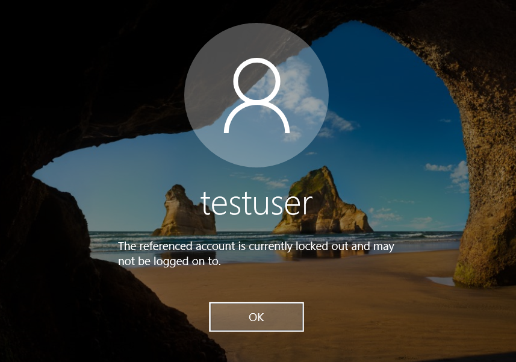
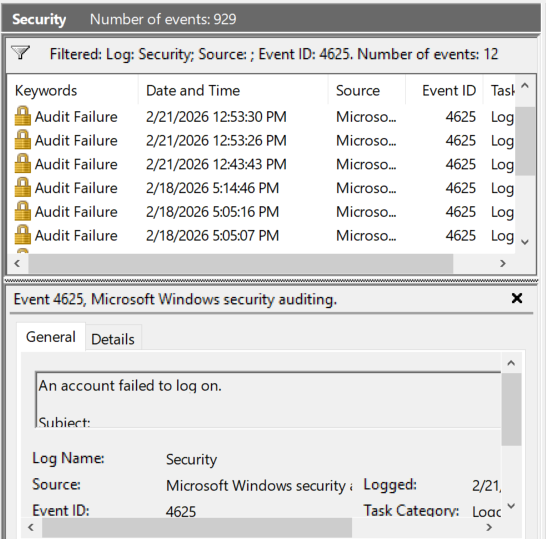
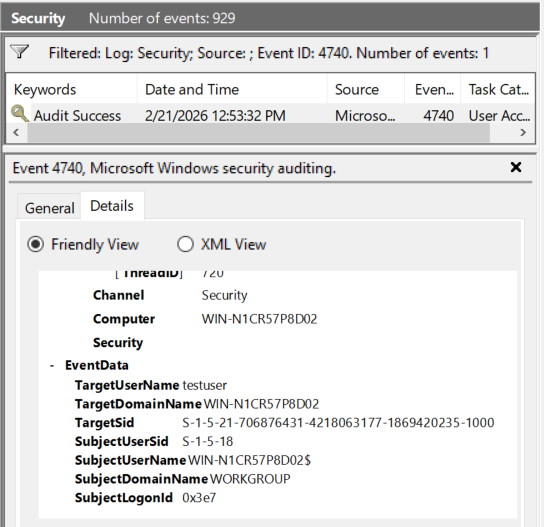

# Windows Account Lockout Investigation Lab

## Objective
Simulate repeated failed login attempts leading to account lockout and investigate correlated Windows Security Events.

## Lab Environment
- Windows Server 2019 Standard Evaluation
- Local test account: testuser
- Account lockout threshold configured to 3 failed attempts
- Event Viewer (Security Log)

## Scenario
Multiple failed login attempts were generated for a local account.  
After exceeding the configured threshold, the account was automatically locked by system policy.

## Investigation Steps

1. Configured Account Lockout Policy in Local Security Policy.
2. Generated 3 consecutive failed login attempts.
3. Confirmed account lockout.
4. Investigated Security Log for:
   - Event ID 4625 (Failed logon attempts)
   - Event ID 4740 (Account lockout)
5. Correlated timestamps to establish authentication sequence.

## Timeline of Events

- Multiple Event ID 4625 entries recorded (failed login attempts)
- Account lockout triggered
- Event ID 4740 logged immediately after threshold exceeded

## Key Findings

- Event ID 4625 confirmed repeated authentication failures.
- Event ID 4740 confirmed system-enforced account lockout.
- Caller Computer Name identified origin of lockout.
- Behavior consistent with excessive failed authentication attempts.

## Security Analysis

In an enterprise SOC environment, this pattern could indicate:

- Brute-force attack
- Credential stuffing attempt
- Automated password spraying
- Or user error

Further investigation would include:
- Reviewing source IP address
- Checking for similar activity across other accounts
- Verifying user activity

## Recommended Actions

- Confirm activity with affected user
- Reset account password if necessary
- Monitor for continued failed authentication attempts
- Consider adjusting lockout thresholds based on organizational policy

---

## Evidence

### Account Lockout Policy

### Account Locked Message
 

### Multiple Failed Logins (Event ID 4625)

### Account Lockout Event Details (Event ID 4740)

